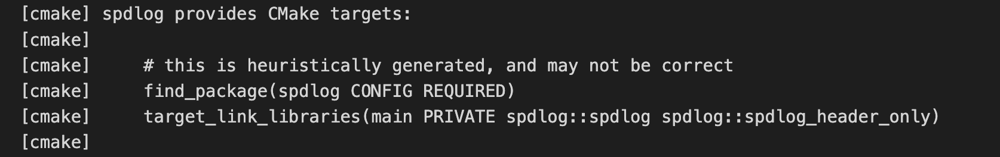
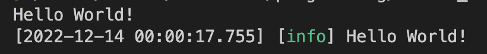

# VScode vcpkg template
## I hope this repository can help you to build C++ project!
Thanks for [vcpkg](https://github.com/microsoft/vcpkg), we can easily bring lots of c++ libraries into our C++ project.
If you get more detail information about vcpkg, please visit sites below!
- [Official repository](https://github.com/microsoft/vcpkg)
- [Official webpage](https://vcpkg.io/en/index.html)
- [Docs](https://vcpkg.readthedocs.io/en/latest/README/)

## How to use this repository

### Set the environment for using vcpkg!
I prepare `Makefile` to install prerequisites of ubuntu/debian and mac.

(Sorry to Windows user.. Please following [this link](Prerequisites) to check prerequisites in Windows.)


Based on your OS, you can set the environment to use vcpkg by using a command below.
``` bash
# Ubuntu
make prepare_ubuntu

# debian
make prepare_debian

# mac
make prepare_mac
```
You can also check what packages will be installed in the Makefile.

### Set your vcpkg configuration
After setting the environment, you can properly use `vcpkg.json` file which manages configurations of vcpkg.
You can browse the library what you want in [this link](https://vcpkg.io/en/packages.html)!

### Include your library!
After putting some libraries in your `vcpkg.json` file, please running reconfigure the CMake in vscode.
While project is reconfigured, you can see the instruction how to include the library into your `CMakeLists.txt` like in the image below.



By following the instruction from kind `vcpkg`, I can use `spdlog` library easily in my project like the image below!




## Summary
One more time, I hope this repository can help you to reduce your stress from including the library into your C++ project!

And if you have any suggestions, questions and issues, don't hesitate to remain or contact to me!

Thanks a lot!